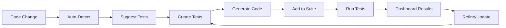

# 🛠️ QA Management System

## 📋 **Complete Test Case Management**

A comprehensive system for managing QA test cases dynamically as your codebase evolves, with CLI tools, web interfaces, and automatic test generation.

## 🎯 **How QA Portal is Managed**

### **🔧 Multiple Management Interfaces**

#### **1. Web Dashboard Interface**
**URL**: `http://localhost:3000/qa-dashboard/test-management`

- ✅ **Visual test case management** - Add, edit, delete test cases through web UI
- ✅ **Category filtering** - Organize by UI, API, Integration, Performance, etc.
- ✅ **Real-time editing** - Modify test steps, expected results, and metadata
- ✅ **Bulk operations** - Generate test suites from selected test cases
- ✅ **Search and filter** - Find specific test cases quickly

#### **2. Command Line Interface**
```bash
# Interactive test case creation
npm run qa:add

# Add test suite for new features
npm run qa:add-feature

# List all existing test cases
npm run qa:list

# Auto-detect new code changes
npm run qa:detect

# Watch for file changes
npm run qa:watch
```

#### **3. Programmatic API**
```javascript
const { TestCaseManager } = require('./qa-automation/test-case-manager')

const manager = new TestCaseManager()
await manager.addTestCase({
  id: 'new-feature-test',
  name: 'Test New Feature',
  category: 'UI',
  steps: ['Navigate to feature', 'Test functionality'],
  expectedResults: ['Feature works correctly']
})
```

## 🚀 **Adding Test Cases On-The-Fly**

### **🔄 Automatic Detection**

#### **Git Hook Integration**
The system automatically detects new code and suggests test cases:

```bash
# After committing new code
npm run qa:detect
```

**Output:**
```
🔍 Detecting New Code Changes
=============================

Changed files:
  📄 app/new-feature/page.tsx
  📄 app/api/new-endpoint/route.ts

💡 Suggested Test Cases:
=======================

1. Test New Feature Page
   Category: UI
   File: app/new-feature/page.tsx
   Description: Test new page component

2. Test New Endpoint API
   Category: API  
   File: app/api/new-endpoint/route.ts
   Description: Test new API endpoint

Create these suggested test cases? (y/n):
```

#### **Real-Time File Watching**
```bash
# Monitor code changes continuously
npm run qa:watch
```

Automatically suggests tests when:
- New pages are added (`app/**/*.tsx`)
- New API routes are created (`app/api/**/*.ts`) 
- New components are built (`components/**/*.tsx`)
- Library functions are added (`lib/**/*.ts`)

### **🎯 Feature-Based Test Generation**

#### **Complete Feature Testing**
```bash
npm run qa:add-feature
```

**Interactive Workflow:**
```
🚀 Add Feature Test Suite
==========================

Feature Name: User Profile Management
Feature Description: Allow users to manage their profiles

Add pages for this feature:
Page Name: Profile Dashboard
Page Path: /profile

Page Name: Profile Settings  
Page Path: /profile/settings

Add APIs for this feature:
API Name: Get Profile
Endpoint: /api/profile
Method: GET

API Name: Update Profile
Endpoint: /api/profile  
Method: PUT

Add user flows:
User Flow Name: Complete Profile Setup
Step 1: Navigate to profile page
Step 2: Fill in profile information
Step 3: Upload profile picture
Step 4: Save changes

✅ Feature Test Suite Created!
Generated Tests: 6
```

**Auto-Generated Test Cases:**
- `user-profile-management-ui-profile` - Profile Dashboard UI test
- `user-profile-management-ui-profile-settings` - Settings page UI test  
- `user-profile-management-api-profile-get` - Get Profile API test
- `user-profile-management-api-profile-put` - Update Profile API test
- `user-profile-management-flow-complete-profile-setup` - End-to-end flow test

## 📝 **Test Case Templates**

### **Automatic Code Generation**

When you add a test case, the system generates executable test code:

#### **UI Test Template**
```javascript
async function testUserProfilePage(page, logger) {
  await logger.log('🖥️  Testing: User Profile Page')
  
  try {
    // Navigate to page
    await page.goto('http://localhost:3000/profile')
    
    // Step 1: Check page loads
    await page.waitForSelector('.profile-container')
    
    // Step 2: Verify user info displays
    const userName = await page.textContent('.user-name')
    expect(userName).toBeTruthy()
    
    // Expected: Page loads within 3 seconds
    // Expected: User information displays correctly
    
    return {
      testId: 'user-profile-page',
      status: 'PASS',
      details: 'Profile page test completed successfully'
    }
    
  } catch (error) {
    return {
      testId: 'user-profile-page', 
      status: 'FAIL',
      error: error.message
    }
  }
}
```

#### **API Test Template**
```javascript
async function testUpdateProfileAPI(baseURL = 'http://localhost:3000') {
  const testData = {
    name: 'Test User',
    email: 'test@example.com'
  }
  
  try {
    const response = await fetch(`${baseURL}/api/profile`, {
      method: 'PUT',
      headers: { 'Content-Type': 'application/json' },
      body: JSON.stringify(testData)
    })
    
    // Validate response
    if (response.status !== 200) {
      throw new Error(`Expected status 200, got ${response.status}`)
    }
    
    const data = await response.json()
    
    return {
      testId: 'update-profile-api',
      status: 'PASS',
      responseTime: Date.now() - startTime,
      data: data
    }
    
  } catch (error) {
    return {
      testId: 'update-profile-api',
      status: 'FAIL', 
      error: error.message
    }
  }
}
```

## 🔄 **Dynamic Test Management**

### **Test Case Categories**

- **🖥️  UI Tests** - Page loading, user interactions, responsive design
- **🔌 API Tests** - Endpoint functionality, data validation, error handling
- **🔗 Integration Tests** - End-to-end user flows, multi-step processes  
- **⚡ Performance Tests** - Load times, response times, memory usage
- **🔒 Security Tests** - Authentication, authorization, data protection
- **🧩 Component Tests** - Individual component functionality

### **Priority System**

- **P0** - Critical (blocks release)
- **P1** - High (important features)
- **P2** - Medium (nice to have)
- **P3** - Low (future enhancements)

### **Smart Test Organization**

#### **Tagging System**
```javascript
tags: ['auth', 'ui', 'smoke', 'critical']
```

#### **Dependency Tracking**
```javascript
dependencies: ['user-registration', 'login-flow']
```

#### **Automation Flags**
```javascript
automatable: true  // Can be automated
automatable: false // Requires manual testing
```

## 🎛️ **Management Workflows**

### **Daily Development Workflow**

#### **1. Code Changes**
```bash
# Make code changes
git add .
git commit -m "Add new user profile feature"

# Auto-detect test needs
npm run qa:detect
```

#### **2. Add Required Tests**
```bash
# Add specific test case
npm run qa:add

# Or add complete feature suite
npm run qa:add-feature
```

#### **3. Run Updated Tests**
```bash
# Test via dashboard (with new tests included)
npm run qa:dashboard-regression

# Or run via CLI
npm run test:qa-regression
```

### **Feature Development Workflow**

#### **1. Plan Feature**
- Define pages, APIs, and user flows needed
- Use `npm run qa:add-feature` to generate test suite

#### **2. Develop Feature**
- Implement pages, APIs, components
- File watcher suggests additional tests automatically

#### **3. Test Feature**
- Generated tests are automatically included in test runs
- Dashboard shows feature-specific test results

#### **4. Refine Tests**
- Use web interface to modify test steps
- Add edge cases and error scenarios
- Update expected results based on implementation

## 📊 **Integration with Dashboard**

### **Seamless Integration**

#### **Test Discovery**
- Dashboard automatically finds all test cases
- Organizes by category, priority, and tags
- Shows test execution history

#### **Real-Time Updates**
- New test cases appear immediately in dashboard
- Test modifications update live results
- Status tracking across development lifecycle

#### **Visual Management**
- **Web Interface** - `http://localhost:3000/qa-dashboard/test-management`
- **Dashboard Overview** - `http://localhost:3000/qa-dashboard`
- **Test Execution** - Click buttons to run specific test categories

### **Test Case Lifecycle**



## 🎯 **Best Practices**

### **Test Case Creation**

#### **Naming Conventions**
- Use kebab-case: `user-profile-edit`
- Include category: `api-user-registration` 
- Be descriptive: `homepage-load-performance`

#### **Step Granularity**
```javascript
// Good - Specific steps
steps: [
  'Navigate to /profile',
  'Click edit button',
  'Update name field',
  'Click save button',
  'Verify success message'
]

// Bad - Vague steps  
steps: [
  'Test profile editing'
]
```

#### **Expected Results**
```javascript
// Good - Measurable results
expectedResults: [
  'Page loads within 3 seconds',
  'Name field accepts 50 characters max',
  'Success message displays for 3 seconds',
  'Database updates with new name'
]

// Bad - Generic results
expectedResults: [
  'Profile editing works'
]
```

### **Feature Test Organization**

#### **Logical Grouping**
```javascript
// Feature: User Authentication
- ui-login-page
- ui-registration-page  
- api-login-endpoint
- api-registration-endpoint
- flow-complete-registration
- flow-login-logout-cycle
```

#### **Priority Assignment**
- **P0** - Login/logout (critical user flows)
- **P1** - Profile management (core features)  
- **P2** - Password reset (important but not blocking)
- **P3** - Social login (nice to have)

## 🚀 **Getting Started**

### **Initialize QA Management**
```bash
# Set up test case management
npm run qa:cli

# Add your first test case
npm run qa:add

# Start file watching for auto-suggestions
npm run qa:watch
```

### **Web Interface Setup**
```bash
# Start development server
npm run dev

# Access management interfaces
# Dashboard: http://localhost:3000/qa-dashboard
# Test Management: http://localhost:3000/qa-dashboard/test-management
```

### **Add Tests for Existing Code**
```bash
# Detect what needs testing
npm run qa:detect

# Add comprehensive feature tests
npm run qa:add-feature

# Review and run new tests
npm run qa:dashboard-regression
```

## 🎉 **Summary**

### **✅ QA Portal Management Features**

- **🔄 Dynamic Test Addition** - Add tests as code evolves
- **🤖 Auto-Detection** - Suggests tests for new code
- **🖥️  Web Interface** - Visual test case management  
- **⌨️  CLI Tools** - Command-line test creation
- **📊 Dashboard Integration** - Real-time test execution
- **🎯 Smart Organization** - Categories, priorities, tags
- **📝 Code Generation** - Automatic test templates
- **👀 File Watching** - Continuous monitoring for changes

### **🎯 Perfect for Evolving Codebases**

The QA management system grows with your code:
- **New features** → Automatic test suggestions
- **Code changes** → Updated test requirements
- **Bug fixes** → Additional edge case tests
- **Performance improvements** → Updated performance benchmarks

**Your QA coverage stays comprehensive and current as your DreamSeed platform evolves!** 🚀